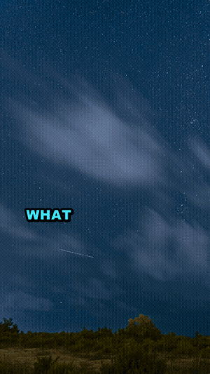
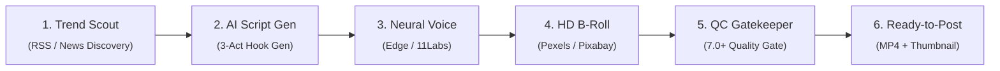
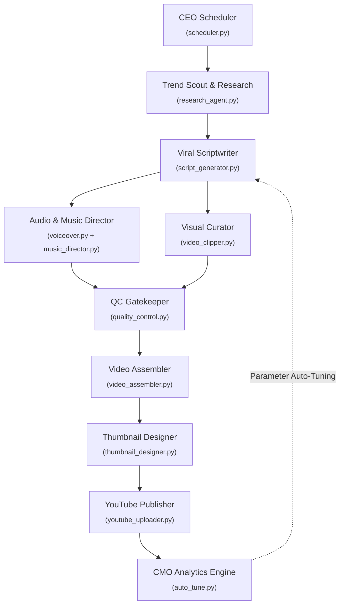

<div align="center">

# 🎬 AutoReel v1.0
### The Open-Source Autonomous AI YouTube Shorts Empire

[](https://www.python.org/)
[](LICENSE)
[](https://ffmpeg.org/)
[](https://www.sqlite.org/)
[](tests/)

<p align="center">
  <b>AutoReel</b> is an autonomous multi-agent content generation platform that monitors trending stories, writes viral 3-act scripts, synthesizes lifelike neural voiceovers, retrieves vertical HD B-roll footage, renders animated karaoke subtitles, enforces quality control gates, publishes to YouTube, and self-tunes based on real audience retention.
</p>

[Quickstart (3 Mins)](#-quick-start-guide-zero-to-video-in-3-minutes) • [100% Free Stack](#-the-100-free--open-source-stack) • [Create Channels](#-creating-your-own-channel-in-60-seconds) • [Pre-Flight Diagnostic](#-system-doctor--pre-flight-check) • [Architecture](docs/ARCHITECTURE.md) • [Pipeline Deep-Dive](docs/PIPELINE_DEEP_DIVE.md)

<br/>
<br/>



</div>

---

## 🌟 What Can AutoReel Do?

Turn a single terminal command into a fully edited, mastered, and subbed **1080x1920 60fps YouTube Short** in under 90 seconds.



- 🤖 **Autonomous Multi-Agent Swarm**: Specialized agents collaborate on research, viral hooks, B-roll curation, music direction, thumbnail rendering, and legal compliance.
- 💬 **Dynamic Animated Subtitles**: Word-level karaoke highlights (`.ass` styling) with glowing text, custom fonts, and safe-zone positioning.
- 🎵 **Mastered Audio & Ducking**: Background music automatically ducks during speech and swells during pauses with broadcast-standard loudness (-14 LUFS).
- 🛡️ **Dual-Layer Quality Control**: Every script must pass automated programmatic checks and a strict creative viral score threshold (≥7.0/10) before assembly.
- 🚀 **24/7 Hands-Free Autopilot**: Built-in scheduler with subprocess isolation, jitter staggering, auto-cleanup, and real-time Telegram telemetry.

---

## 💸 The 100% Free & Open-Source Stack

You can run AutoReel **completely free with zero credit card required**:

| Component | Default Free Engine | Why It's Great |
| :--- | :--- | :--- |
| **Primary AI** | **Groq** (`openai/gpt-oss-120b`) | Free tier offers **14,400 requests/day** at ~800 tokens/sec. |
| **Voiceover** | **Microsoft Edge TTS** | Built-in high-quality neural voices. **Zero API keys or accounts needed.** |
| **HD Video B-Roll** | **Pexels API** | Free access to millions of vertical HD stock clips (200 req/hr). |
| **Video Compositing** | **FFmpeg** | Industry-standard open-source video rendering engine. |
| **Database** | **SQLite WAL** | Embedded, thread-safe, and requires zero database servers. |

*(Optional upgrades supported out of the box: Google Cloud TTS, ElevenLabs, Gemini 2.0 Flash, OpenRouter, NVIDIA NIM).*

---

## ⚡ Quick Start Guide (Zero to Video in 3 Minutes)

Follow these 4 simple steps to generate your first video from scratch.

### Step 1: Install Prerequisites (Python & FFmpeg)

<details open>
<summary><b>🪟 Windows Installation</b></summary>

Open **PowerShell as Administrator** and run:
```powershell
# Install Python and FFmpeg via winget (or Chocolatey: choco install python ffmpeg)
winget install Python.Python.3.11
winget install Gyan.FFmpeg

# Allow PowerShell script execution for virtual environments
Set-ExecutionPolicy -Scope Process -ExecutionPolicy Bypass
```
*(Restart PowerShell after installation).*
</details>

<details>
<summary><b>🍎 macOS Installation</b></summary>

Open **Terminal** and run:
```bash
brew install python ffmpeg
```
</details>

<details>
<summary><b>🐧 Ubuntu / Debian Linux Installation</b></summary>

Open **Terminal** and run:
```bash
sudo apt update && sudo apt install -y python3-pip python3-venv ffmpeg imagemagick git
```
</details>

---

### Step 2: Clone & Set Up Environment

```bash
# 1. Clone the repository
git clone https://github.com/MuditRanjan000/AutoReel.git
cd AutoReel

# 2. Create and activate virtual environment
python -m venv venv
# On Windows:
.\venv\Scripts\activate
# On macOS / Linux:
source venv/bin/activate

# 3. Install Python dependencies
pip install --upgrade pip
pip install -r requirements.txt
```

---

### Step 3: Add Your Free API Keys

1. Copy the example configuration:
   ```bash
   cp .env.example .env
   ```
2. Open `.env` in any text editor and fill in two free keys:
   - **Groq API Key**: Get free instantly at [console.groq.com](https://console.groq.com/keys) (No credit card).
   - **Pexels API Key**: Get free instantly at [pexels.com/api](https://www.pexels.com/api/) (No credit card).

```env
GROQ_API_KEY_1=gsk_your_free_groq_key_here
PEXELS_API_KEY_1=your_free_pexels_key_here
AUTO_POST_YOUTUBE=False
```

---

### Step 4: Run Pre-Flight Diagnostic & Generate Your First Video!

Run the system doctor to make sure everything is configured properly:
```bash
python check_setup.py
```

If all checks pass, generate your first video with the included demo channel:
```bash
python execution/run_pipeline.py --channel demo_channel
```

🎉 **Done!** Your completed video will be saved to:
`output/videos/<run_id>_final.mp4`

---

## 🎨 Creating Your Own Channel in 60 Seconds

Each channel is defined by a simple JSON file in `channels/<your_channel>.json`.

Create `channels/my_tech_channel.json`:

```json
{
  "CHANNEL_NAME": "my_tech_channel",
  "DISPLAY_NAME": "Future Tech Daily",
  "NICHE": "Artificial intelligence, space technology, robotics, and emerging science",
  "CHANNEL_TONE": "Mind-blowing, fast-paced, authoritative, and gripping",
  "TARGET_AUDIENCE": "Tech enthusiasts, curious minds, and engineers",
  
  "VOICE_PROVIDER": "edge",
  "voice": "en-US-ChristopherNeural",
  "voice_rate": "+10%",
  
  "video_duration_seconds": 55,
  "MIN_WORDS": 110,
  "MAX_WORDS": 140,
  "FPS": 30,
  
  "VISUAL_MODE": "stock_plus_wiki",
  "STOCK_PROVIDER": "pexels",
  "DEFAULT_BGM_MOOD": "sci-fi",
  "BGM_VOLUME": 0.12,
  
  "CAPTION_STYLE": "yellow_glow",
  "active": true
}
```

Run your new channel:
```bash
python execution/run_pipeline.py --channel my_tech_channel
```

---

## 🤖 Multi-Agent Architecture

AutoReel runs an interconnected multi-agent workflow where specialized AI personas handle distinct phases of production:



| Agent | Responsibility | Primary Engine |
| :--- | :--- | :--- |
| **CEO Scheduler** | Multi-channel timeline management, storage cleanup, systemd daemon | `scheduler.py` |
| **Trend Scout** | Real-time RSS news discovery, story clustering, deduplication | `core/trend_fetcher.py` |
| **Research Agent** | Fact verification, context expansion, emotional lens locking | `core/agents/research_agent.py` |
| **Viral Scriptwriter** | 3-act narrative, pattern-interrupt hooks, comment-driving CTAs | `core/script_generator.py` |
| **Visual Curator** | Semantic search queries, Pexels/Pixabay retrieval, Ken Burns pan-zoom | `core/video_clipper.py` |
| **Audio Director** | Neural voice synthesis, phonetic dictionary mapping, dynamic ducking | `core/voiceover.py`, `core/agents/music_director.py` |
| **Quality Control** | Programmatic text sanitization, SSML stripping, 7.0+ viral score gate | `core/agents/quality_control.py` |
| **Publisher** | Anti-bot human delay, metadata formatting, YouTube API publication | `core/youtube_uploader.py` |
| **CMO Analytics** | YouTube Analytics ingestion, virality scoring, parameter auto-tuning | `execution/auto_tune.py` |

---

## 🚀 Running 24/7 on Autopilot

To run AutoReel continuously across all active channels:

```bash
python scheduler.py
```

The CEO daemon will:
1. Load all channels marked `"active": true` in `channels/*.json`.
2. Schedule daily staggered posting slots (e.g. 04:00, 08:00, 12:00, 20:00).
3. Ingest YouTube Analytics performance metrics at `00:30`.
4. Perform automated garbage collection of old render files at `03:00` and `15:00`.
5. Send real-time status and alerts directly to your Telegram bot.

For systemd service configuration on Linux servers, see the **[Production Deployment Guide](docs/PRODUCTION_DEPLOYMENT.md)**.

---

## 🩺 System Doctor & Pre-Flight Check

AutoReel includes a built-in diagnostic tool to ensure your environment is 100% healthy:

```bash
python check_setup.py
```

Output:
```text
==========================================================
       AutoReel v1.0 -- Pre-Flight System Diagnostic      
==========================================================

  [✔] Python Version (>= 3.10)
      Detected Python 3.11.4
  [✔] FFmpeg Binary in PATH
      Detected ffmpeg version 6.1.1
  [✔] Free Disk Space (>= 2.0 GB)
      45.8 GB free disk space available
  [✔] .env Configuration File
      Found at /path/to/AutoReel/.env
  [✔] Channel Configurations
      Found 2 profile(s): demo_channel.json, example_channel.json
  [✔] Primary AI LLM Keys
      Groq: 2 key(s)
  [✔] Stock Footage Video Keys
      Pexels: 1 key(s)
  [✔] Text-to-Speech Engine
      Microsoft Edge TTS active (Free & Ready)

----------------------------------------------------------
All pre-flight checks passed! AutoReel is ready to run.
```

---

## ❓ Frequently Asked Questions (FAQ)

<details>
<summary><b>1. 'ffmpeg' is not recognized as an internal or external command?</b></summary>

FFmpeg is not installed or not in your system's `PATH`.
- **Windows**: Run `winget install Gyan.FFmpeg` or download from [gyan.dev](https://www.gyan.dev/ffmpeg/builds/) and add the `bin` folder to your Windows System PATH.
- **macOS**: Run `brew install ffmpeg`.
- **Ubuntu/Debian**: Run `sudo apt install ffmpeg`.
</details>

<details>
<summary><b>2. PowerShell says "running scripts is disabled on this system"?</b></summary>

Run this command once in PowerShell:
```powershell
Set-ExecutionPolicy -Scope Process -ExecutionPolicy Bypass
```
Then run `.\venv\Scripts\activate`.
</details>

<details>
<summary><b>3. How do I change voices or listen to available free voices?</b></summary>

AutoReel includes dozens of free neural voices via Edge TTS. To list all available voices:
```bash
python -c "import asyncio, edge_tts; voices = asyncio.run(edge_tts.list_voices()); print('\n'.join([f\"{v['ShortName']} ({v['Gender']}, {v['Locale']})\" for v in voices if 'en-' in v['Locale']]))"
```
Common popular voices:
- `en-US-ChristopherNeural` (Authoritative, tech male)
- `en-US-GuyNeural` (High-energy, passionate male)
- `en-US-JennyNeural` (Clear, natural female)
- `en-GB-RyanNeural` (Sophisticated British male)
</details>

<details>
<summary><b>4. How do I upload directly to YouTube automatically?</b></summary>

1. Follow the **[YouTube OAuth Guide](directives/upload_to_youtube.md)** to download `youtube_client_secrets.json`.
2. Authorize your channel: `ACTIVE_CHANNEL=demo_channel python execution/authorize_youtube.py`.
3. Set `AUTO_POST_YOUTUBE=True` in `.env`.
</details>

<details>
<summary><b>5. Can I test the pipeline without uploading anything?</b></summary>

Yes! By default, `AUTO_POST_YOUTUBE=False` in `.env`. The pipeline will render the full 1080x1920 MP4 video and save it locally to `output/videos/` so you can watch and inspect it.
</details>

---

## 🧪 Testing & Verification

Run the contributor sanity test suite:
```bash
pytest tests/ -v
```

---

## 📚 Deep-Dive Documentation

- 🏛️ **[Architecture & Design Specification](docs/ARCHITECTURE.md)**: In-depth 3-layer breakdown, SQLite WAL schemas, and fault tolerance.
- 🔄 **[10-Stage Pipeline Deep-Dive](docs/PIPELINE_DEEP_DIVE.md)**: Detailed step-by-step lifecycle from RSS ingest to YouTube Analytics.
- ⚙️ **[Configuration & Channel Guide](docs/CONFIGURATION_GUIDE.md)**: Full JSON schema reference, phonetic maps, and subtitle styling.
- 🚀 **[Production & Cloud Deployment Guide](docs/PRODUCTION_DEPLOYMENT.md)**: Headless Ubuntu server setup, systemd daemons, and storage maintenance.

---

## 🤝 Contributing

Contributions, bug reports, and suggestions are welcome! Please review [CONTRIBUTING.md](CONTRIBUTING.md) and [SECURITY.md](SECURITY.md) before submitting a Pull Request.

---

## 📄 License

This project is licensed under the MIT License — see the [LICENSE](LICENSE) file for details.

<div align="center">
  <sub>Built with ❤️ for the open-source creator community by <a href="https://github.com/MuditRanjan000">Mudit Ranjan</a></sub>
</div>
