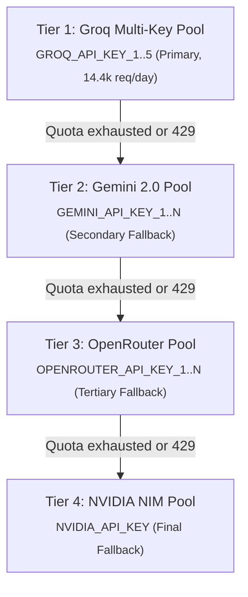

# Directive: Manage LLM API Quotas & Cascading Failover

## Overview

AutoReel uses a multi-tier, multi-key cascading LLM engine to guarantee zero-downtime script generation even when individual provider rate limits are reached.



---

## 1. Primary AI: Groq Setup & Multi-Key Load Balancing

Groq provides extremely fast inference (~800 tokens/sec) and a generous free tier of **14,400 requests/day** per key.

To scale capacity, add multiple free Groq keys to `.env`:
```env
GROQ_API_KEY_1=gsk_first_key_here
GROQ_API_KEY_2=gsk_second_key_here
GROQ_API_KEY_3=gsk_third_key_here
```
AutoReel automatically round-robins across all configured keys in `core/gemini_client.py`. If one key hits a rate limit, the client seamlessly retries on the next key.

---

## 2. Fallback AI: Google Gemini

If all Groq keys are exhausted or unavailable, the engine automatically cascades to Google Gemini:
```env
GEMINI_API_KEY_1=your_first_gemini_key
GEMINI_API_KEY_2=your_second_gemini_key
```

Get free API keys at [Google AI Studio](https://aistudio.google.com/apikey).

---

## 3. Fallback AI: OpenRouter & NVIDIA

For extra resilience, add optional OpenRouter and NVIDIA keys:
```env
OPENROUTER_API_KEY_1=sk-or-v1-your_key_here
NVIDIA_API_KEY=nvapi-your_key_here
```

---

## 4. Quota Diagnostic & Pre-Flight Check

To verify all configured keys and quota health, run:
```bash
python check_setup.py
```
Or check individual quota status:
```bash
python execution/check_quota.py
```

