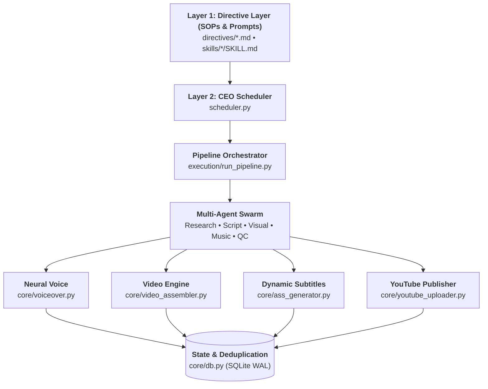
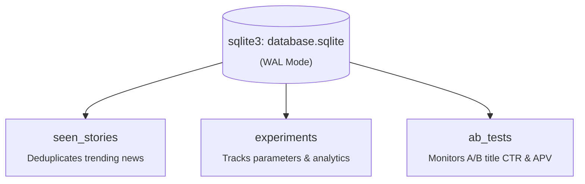

# 🏛️ AutoReel v1.0 Architecture & Design Specification

> **AutoReel** is an enterprise-grade autonomous content generation and multi-channel YouTube automation platform. It coordinates multi-agent intelligence, multi-modal visual retrieval, neural voice synthesis, dynamic video assembly, automated quality gating, and closed-loop algorithmic feedback.

---

## 1. High-Level Design: The 3-Layer Architecture

AutoReel separates probabilistic AI reasoning from deterministic media assembly using a robust 3-layer architecture:

### Layer 1: Directive Layer (`directives/` & `skills/`)
- **Purpose**: Defines Standard Operating Procedures (SOPs), viral scripting frameworks, visual curation policies, and quality scoring rubrics in structured Markdown.
- **Benefits**: AI agents reason against version-controlled directives without hardcoded logic.

### Layer 2: Orchestration Layer (`scheduler.py` & `execution/run_pipeline.py`)
- **Purpose**: Manages multi-channel scheduling, subprocess isolation, error propagation (`ContentFailure` vs `InfrastructureFailure`), quota throttling, and LLM load balancing across multi-key pools.
- **Benefits**: Channels operate in strict subprocess isolation; memory leaks or unexpected exceptions in one channel never crash the supervisor daemon.

### Layer 3: Execution Layer (`core/`)
- **Purpose**: Deterministic, high-performance engines written in Python, FFmpeg, ImageMagick, and SQLite WAL.
- **Benefits**: Fast, testable, reproducible media rendering with millisecond-accurate audio/video synchronization and database persistence.

---

## 2. Multi-Agent Ecosystem

| Agent | Responsibility | Core Logic / Module | Primary External API |
| :--- | :--- | :--- | :--- |
| **CEO Scheduler** | Master orchestrator, daily time-slot management, memory janitor, Telegram telemetry | `scheduler.py` | Telegram Bot API |
| **Trend Scout** | Multi-source RSS aggregation, news clustering, novelty scoring | `core/trend_fetcher.py` | Google Trends, RSS feeds |
| **Research Agent** | Deep fact-checking, context expansion, counter-perspective synthesis | `core/agents/research_agent.py` | Groq / Gemini 2.0 |
| **Viral Scriptwriter** | Hook generation, emotional lens framing, 3-act narrative, comment CTAs | `core/script_generator.py` | Groq (Llama 3.3 70B) / OpenRouter |
| **Visual Curator** | Semantic search query formulation, B-roll ranking, Pexels/Pixabay retrieval | `core/video_clipper.py` | Pexels API, Pixabay API, yt-dlp |
| **Audio Director** | Voice synthesis, phonetic replacement, dynamic BGM mood matching, ducking | `core/voiceover.py`, `core/agents/music_director.py` | ElevenLabs / Edge TTS / Google Cloud TTS |
| **Quality Control Gate** | Programmatic text checks, SSML sanitization, 5-point creative viral rubric | `core/agents/quality_control.py`, `execution/review_video.py` | Groq / Gemini |
| **Video Reviewer** | Visual consistency, frame-by-frame pacing, text readability review | `core/agents/video_quality_reviewer.py` | Gemini 2.0 Flash Vision |
| **Publisher** | Anti-bot human delay, metadata formatting, thumbnail upload, YouTube publication | `core/youtube_uploader.py` | YouTube Data API v3 |
| **CMO Analytics** | Daily YouTube Analytics ingestion, composite virality scoring, parameter auto-tuning | `execution/analyze_performance.py`, `execution/auto_tune.py` | YouTube Analytics API v2 |

---

## 3. Data Flow & State Management

AutoReel utilizes **SQLite in Write-Ahead Logging (WAL) mode** for thread-safe, high-concurrency state tracking.

- **Connection Lifecycle**: Every database helper uses strict `try ... finally: conn.close()` to prevent connection leaks and file descriptor exhaustion.
- **Indexes**: 14 composite and column indexes optimize lookup speeds across large historical archives.

---

## 4. Fault Tolerance & Reliability Patterns

1. **Subprocess Isolation**: Each channel pipeline executes in a separate Python interpreter with its own environment variables, isolated memory space, and dedicated output logs.
2. **Cascading API Fallbacks**:
   - *LLM Engine*: Groq Multi-Key Pool (6 keys) $\rightarrow$ Gemini 2.0 $\rightarrow$ OpenRouter $\rightarrow$ NVIDIA NIM.
   - *Voice Synthesis*: ElevenLabs $\rightarrow$ Google Cloud TTS Journey/Neural2 $\rightarrow$ Microsoft Edge TTS.
   - *Visual Footage*: Pexels HD $\rightarrow$ Pixabay HD $\rightarrow$ Wikimedia Commons $\rightarrow$ Ken Burns Pan-Zoom Engine.
3. **SSML & Phonetic Safety**: Full phonetic transformation maps (`config/phonetic_map.json`) normalize difficult names across all TTS engines with zero XML attribute bleed into subtitle or script quality gates.
4. **Storage Janitor**: Automated twice-daily garbage collection deletes intermediate temporary footage older than 12 hours, maintaining stable disk usage indefinitely.
