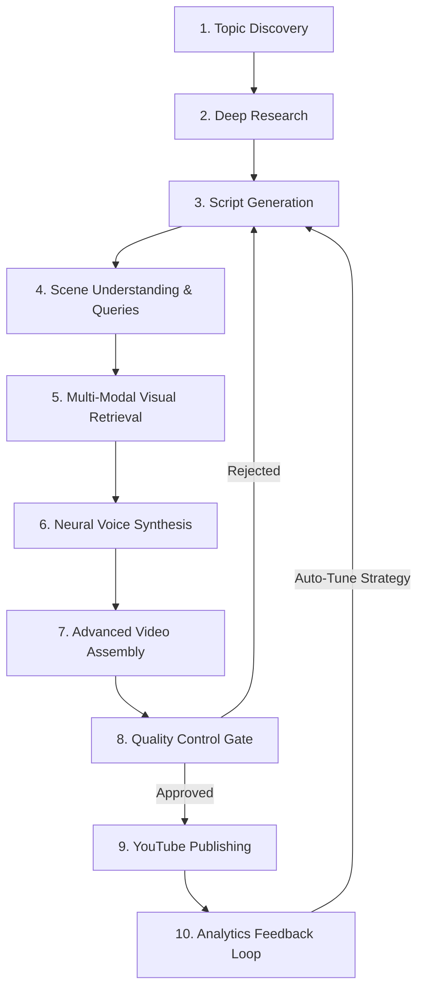

# 🔄 AutoReel 10-Stage Pipeline Deep-Dive

> This document details the end-to-end lifecycle of an AutoReel video generation run, from real-time topic discovery to YouTube publication and performance feedback.

---

---

## Stage 1: Topic Discovery & Deduplication (`core/trend_fetcher.py`)
- **Action**: Polls 15+ curated RSS feeds, Google Trends, and niche publications based on the active channel's profile.
- **Deduplication**: Computes an MD5 hash of story titles and URLs, checking against the `seen_stories` table in SQLite.
- **Scoring**: Filters out stories with low novelty scores or generic press releases.

---

## Stage 2: Deep Research & Angle Synthesis (`core/agents/research_agent.py`)
- **Action**: Synthesizes background context, verifies factual dates/numbers, and identifies the core emotional conflict.
- **Framing**: Locks the narrative into one of 6 viral emotional lenses: *Drama, Money, Fear, Mistakes, Secrets, or Conflict*.

---

## Stage 3: Viral Script Generation (`core/script_generator.py`)
- **Action**: Generates a high-retention 50–58 second script (~120–140 words) strictly structured in 3 acts:
  1. **The Hook (0–3s)**: High-impact pattern interrupt or shocking contradiction (no warmups or soft openers).
  2. **The Escalation (3–45s)**: Fast-paced narrative progression, tension escalation, and proof points.
  3. **The Payoff & Comment CTA (45–55s)**: Climax resolution followed by a fierce single-word comment prompt.
- **Phonetic Normalization**: Applies regex substitutions from `config/phonetic_map.json` and inserts SSML tags (``, `<break time="300ms"/>`).

---

## Stage 4: Scene Understanding & Query Formulation (`core/script_generator.py`)
- **Action**: Segments the full script into 5–8 discrete chronological scenes.
- **Metadata Extraction**: Generates precise 2–3 word search queries for stock video retrieval, visual mood parameters, and background music matching.

---

## Stage 5: Multi-Modal Visual Retrieval (`core/video_clipper.py`)
- **Primary Retrieval**: Queries Pexels & Pixabay APIs for vertical 9:16 HD stock video clips matching scene queries.
- **Fallback Retrieval**: Downloads high-resolution editorial imagery from Wikimedia Commons and applies an automated Ken Burns dynamic pan/zoom motion filter.
- **Semantic Validation**: Optional Gemini Vision scoring to ensure retrieved visual assets match the spoken context.

---

## Stage 6: Neural Voice Synthesis & Word-Level Timing (`core/voiceover.py`)
- **Engine Selection**: Automatically routes to ElevenLabs, Google Cloud TTS (Journey / Neural2), or Microsoft Edge TTS based on channel configuration.
- **Timing Extraction**: Generates word-level timestamps (via Whisper or TTS alignment metadata) with millisecond accuracy.
- **Subtitle Generation (`core/ass_generator.py`)**: Builds an Advanced SubStation Alpha (`.ass`) file with custom font rendering, karaoke word-by-word highlights, and shadow glows.

---

## Stage 7: Video Assembly & Audio Mastering (`core/video_assembler.py`)
- **FFmpeg Filtergraph**:
  - Scales, crops, and centers all clips to **1080x1920 (9:16 aspect ratio)** at strict **30.0 fps**.
  - Applies color grading and subtle vignette.
  - Burns dynamic ASS subtitles directly into video frames.
- **Audio Mastering**:
  - Mixes voiceover narration (normalized to -14 LUFS) with background music.
  - Applies dynamic audio ducking (BGM volume drops to 10% during speech, recovers during pauses).

---

## Stage 8: Automated Quality Control Gate (`execution/review_video.py`)
- **Programmatic Pre-Checks**:
  - Voiceover duration verification (must fit 45s–58s limits).
  - Sentence length and word repetition checks (with full SSML tag stripping).
  - Number & factuality cross-validation against original source story.
- **LLM Creative Quality Gate**:
  - Evaluates script against 5 viral criteria: *Hook Power, Emotional Category, Angle Surprise, Host Personality, Human Rhythm*.
  - Strict 7.0/10 minimum score threshold required for upload approval.

---

## Stage 9: Anti-Bot Scheduling & YouTube Upload (`core/youtube_uploader.py`)
- **Anti-Bot Throttling**: Applies a randomized 2–8 minute human-pattern delay before contacting the YouTube API.
- **Upload**: Pushes video to YouTube Data API v3 with optimized title, description, relevant hashtags, and category IDs.
- **Thumbnail Injection**: Uploads custom thumbnail frame and notifies the operator via Telegram.

---

## Stage 10: Closed-Loop Analytics & Auto-Tuning (`execution/auto_tune.py`)
- **Metrics Ingestion (`execution/fetch_analytics.py`)**: Daily sync queries YouTube Analytics API for Average Percentage Viewed (APV), Video View Rate (VVR), and total views.
- **Performance Analysis (`execution/analyze_performance.py`)**: Calculates composite virality scores across A/B tested parameters (Voice, Pace, Hook Style, BGM Mood).
- **Auto-Tune Injection**: Winning configurations are automatically injected into `channels/<channel>.json`, completing the autonomous feedback loop.
